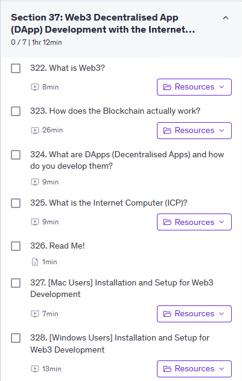
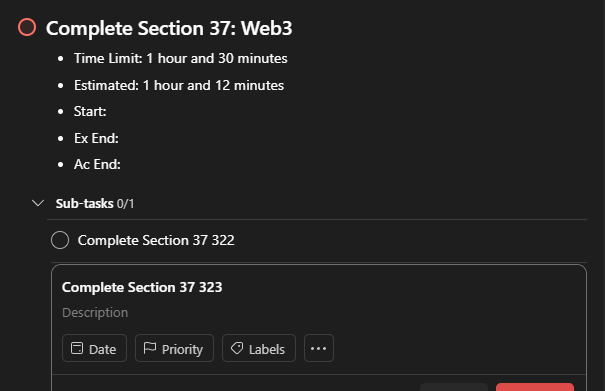
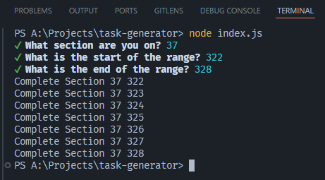

# Purpose

I am just too lazy to create multiple tasks on Todoist one by one.

# Use Case Scenario

You want to make every section and subsection in Udemy as a task in Todoist.



However, you are too lazy to write tasks one by one.



With this simple app you just need to answer a few questions and you can copy and paste the output into Todoist.



# Usage

1. download this project
2. run `npm install`
3. run `node index.js`
4. answer the following questions

```js
// Here is an example
{
  "section": "37",
  "start": "322",
  "end": "328"
}
```
